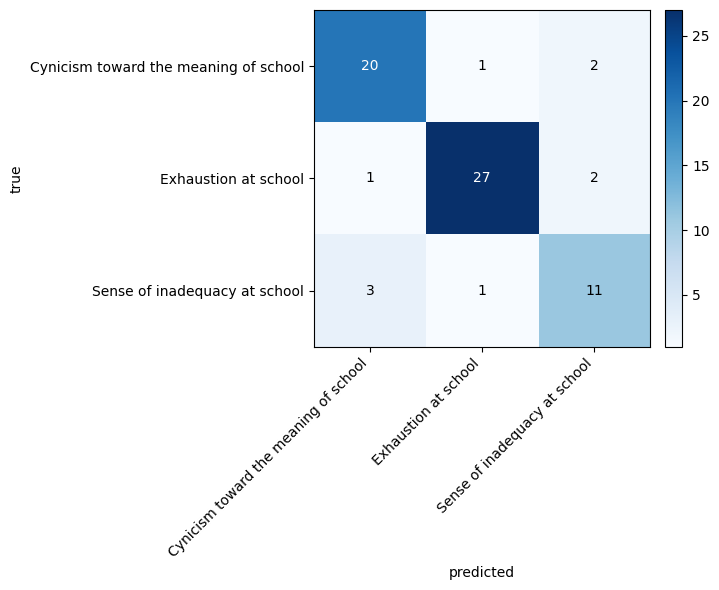
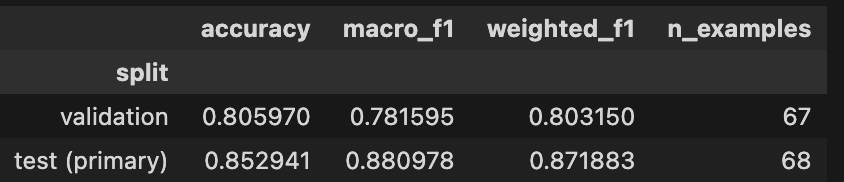
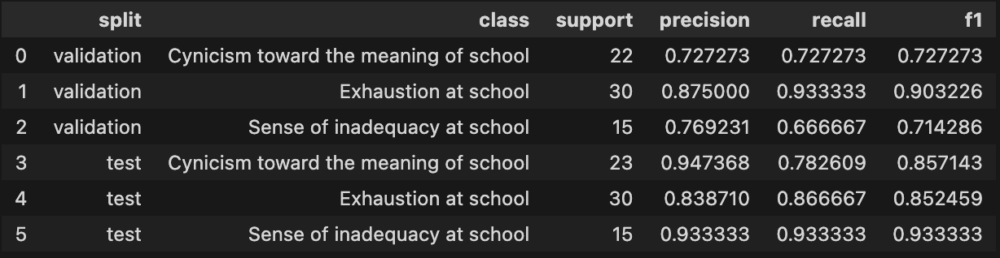

# Grounded-theory pipeline

This repository implements an **agentic grounded-theory (GT) workflow**: unstructured text is taken through open coding, axial clustering, hierarchy construction, meta-theme grouping, and assembly of a global thematic graph, with optional downstream reporting and co-occurrence analysis. The LangGraph-based runner lives under `agents/`; prompt “skills” live in `agents/skills/`. Figures below summarize the **end-to-end pipeline** and **validation** of theme recovery against a reference coding.

---

## Pipeline overview

The diagram is a single-page map of how data moves through tools and artifacts (codes → clusters → hierarchy → meta-themes → global graph). Use it when onboarding to the repo or when tracing which stages feed which intermediate JSON under `agents/outputs/data/`.

---

## Validation: theme recovery

We compare predicted theme assignments to a reference codebook on the evaluation split. The overview figure summarizes the setup and headline numbers; the plots below show agreement patterns and scores in more detail.

### Results

**Confusion matrix** — predicted vs. reference labels; the diagonal is correct assignments.

**Overall scores** — aggregate metrics in one view.

**Per-class scores** — metric broken down by theme.

---

## Artifacts and evaluation

- **Figures in `artifacts/`** are checked in for quick viewing in GitHub or internal docs; regenerate them from the evaluation notebooks or scripts when you refresh data or metrics.
- **Notebook-based evaluation** for theme recovery lives in `evaluation/theme_recovery_eval.ipynb`; keep this README in sync when you rename metrics or file paths so the links above stay valid.
