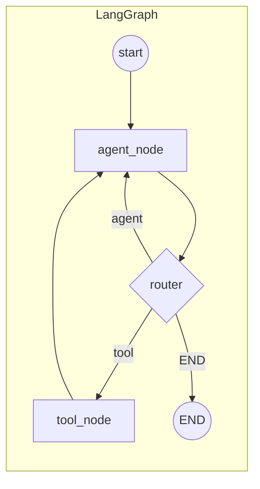
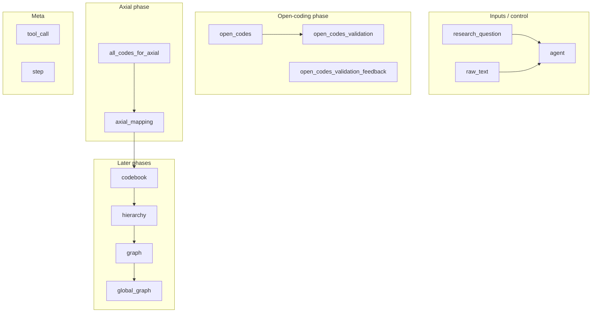

# Grounded Theory (LOGOS) Pipeline — Overview & Deep Dive

> **What this is:** An end-to-end pipeline that turns a **research question** and a **corpus** (e.g. reviews) into a **structured codebook graph** — concepts, clusters, and relationships — using LLMs, embeddings, and graph reasoning. The control flow is a **LangGraph** with one agent node, one tool node, and a router that decides what runs next.

---

## Table of contents

1. [High-level overview](#part-1--high-level-overview) — big picture, LangGraph role, pipeline steps  
2. [How the graph runs](#part-2--how-the-graph-actually-runs) — graph structure, state, router  
3. [File roles](#part-3--file-roles-and-where-things-live) — what each file does  
4. [Data flow](#part-4--data-flow-what-gets-written-where) — artifacts and dependencies  
5. [Tools reference](#part-5--tools-in-one-table) — all tools, inputs, outputs  
6. [How to run what](#part-6--quick-reference-how-to-run-what) — commands

---

## Part 1 — High-level overview

### The big picture

```
┌─────────────────────────────────────────────────────────────────────────────┐
│  RESEARCH QUESTION + CORPUS (e.g. CSV of reviews)                           │
└─────────────────────────────────────────────────────────────────────────────┘
                                        │
                                        ▼
┌─────────────────────────────────────────────────────────────────────────────┐
│  LANGGRAPH (agent ↔ tool, router decides next step)                         │
│  • Open coding (per review) + validator                                     │
│  • Axial: embed + K-means → clusters                                        │
│  • High-level labels → codebook                                              │
│  • Hierarchy → graph → global graph                                          │
└─────────────────────────────────────────────────────────────────────────────┘
                                        │
                                        ▼
┌─────────────────────────────────────────────────────────────────────────────┐
│  ARTIFACTS: gt_codes_only.json, gt_clustered_codes.json, codebook.json,     │
│             gt_hierarchy.json, gt_graph.json, gt_global_graph.json           │
└─────────────────────────────────────────────────────────────────────────────┘
                                        │
                                        ▼ (optional)
┌─────────────────────────────────────────────────────────────────────────────┐
│  POST-PROCESS: codebook_cleanup.py → gt_global_graph_cleaned.json             │
└─────────────────────────────────────────────────────────────────────────────┘
```

### How LangGraph fits

> **Key idea:** The pipeline is **not** a chatbot. It’s a **state machine**: the agent node only *chooses* which tool to run; the tools do the LLM/embedding work. The router then sends control to the tool, back to the agent, or to END.

The pipeline is **one compiled LangGraph** with:

| Piece | Role |
|-------|------|
| **State** | `GTState` — a single dict that accumulates `open_codes`, `axial_mapping`, `codebook`, `hierarchy`, `graph`, `global_graph`, plus validation fields and flags. |
| **Agent node** | Reads state and **decides which tool to call** (and with which args). It does not call the LLM for reasoning; it’s a deterministic “orchestrator” that picks the next tool. |
| **Tool node** | Runs the **actual tool** (e.g. `open_coding`, `axial_coding`) and **writes back** into state (e.g. `updates["open_codes"] = clean_output`). |
| **Router** | After each agent step, the router looks at state and returns: go to **tool**, go to **agent** again, or **END**. So the loop is: **agent → (router) → tool or END or agent**. |
| **Edges** | `agent --[router]--> tool | END | agent`; then `tool --> agent` always. So tools always hand back to the agent. |

So: **no separate “LLM agent” node**. The “brain” is inside the **tools** (e.g. `open_coding` and `validate_open_codes` call the LLM). The graph is a **tool-calling state machine**: agent chooses tool → tool runs → state updates → agent chooses again until the router says END.

| You might expect… | What we have instead |
|-------------------|----------------------|
| An “LLM agent” that reasons and picks tools | A **deterministic agent_node** that looks at state and returns `tool_call: { tool, args }` |
| Tools as external APIs | Tools in **tools.py** (same process); they call the LLM and read/write files |
| Multiple agent types | **One** agent, **one** tool node; the *name* of the tool (open_coding, axial_coding, …) is what changes |

### End-to-end pipeline steps (conceptual)

| # | Step | What happens | LLM? | Main output |
|---|------|----------------|------|-------------|
| 1 | **Open coding** | For each review: extract 1–5 short codes (noun phrases); then **validate**; on FAIL, retry with feedback (max 2 retries). | Yes (generator + validator) | `open_codes` per review → collected in `gt_codes_only.json` |
| 2 | **Axial coding** | Embed all codes, K-means (K from Silhouette), write clusters to disk. | No | `gt_clustered_codes.json` |
| 2b | **High-level labels** | One LLM call per cluster to name the cluster. | Yes | `codebook.json` |
| 4 | **Hierarchy** | Per cluster: embed codes, filter pairs by similarity, LLM classifies relation (equivalent / subsumes / subsumed_by / orthogonal), build hierarchy. | Yes | `gt_hierarchy_edges.jsonl`, `gt_hierarchy.json` |
| 5 | **Graph** | From hierarchy: BFS transitivity, deduction-first conflict; per-cluster graph. | No | `gt_graph.json` |
| 6 | **Global graph** | Merge clusters, optional cross-cluster LLM links, global transitivity. | Optional | `gt_global_graph.json` |
| — | **Codebook clean-up** | Post-process: equivalence closure, representative selection, collapse low-freq, remove orphans. | No | `gt_global_graph_cleaned.json` |

---

## Part 2 — How the graph actually runs

### Graph structure (LangGraph)



- **Entry:** `graph.set_entry_point("agent")` → first node is **agent**.
- **Agent:** Returns a state update that includes `tool_call: { tool, args }` (or no tool call).
- **Router:** Reads state. If `tool_call` is set → **"tool"**. Else, depending on state (e.g. have `open_codes` and validation PASS → **END**; need more work → **"agent"**).
- **Tool:** Runs `TOOLS[tool_name].invoke(args)`, then applies a fixed mapping from tool name to state keys (e.g. `open_coding` → `open_codes`). Sets `tool_call: None` and returns updates.
- **Loop:** Tool always goes back to **agent**. So each “step” is: agent → router → tool → agent → router → … until router returns END.

### State (GTState) at a glance



- **Per-review open coding:** You invoke the graph with `raw_text` = one review. State gets `open_codes`, then `open_codes_validation` (PASS/FAIL). When PASS (or max retries), router returns END; caller collects `open_codes` and then invokes again for the next review.
- **Axial and beyond:** You invoke with `all_codes_for_axial` set (no `raw_text`). Agent calls `axial_coding` → then `axial_mapping` is the cluster summary text. For high-level, hierarchy, graph, global_graph you re-invoke with **sentinel values** in `axial_mapping` (`"done"`, `"hierarchy"`, `"graph"`, `"global_graph"`) so the agent knows which tool to run next.

### Router logic (simplified)

| Condition | Router result |
|-----------|----------------|
| `tool_call` is set | → **tool** (execute the requested tool) |
| Have `open_codes`, no `all_codes_for_axial` | If validation **None** → **agent** (run validator). If **PASS** → **END**. If **FAIL** and retries left → **agent** (retry open_coding). Else → **END** |
| Have `axial_mapping` (long text), not done/hierarchy/graph/global_graph | → **END** (axial phase done; no cluster validator in current code) |
| `axial_mapping == "done"`, no `codebook` | → **agent** (run high_level_code_generation) |
| Have `codebook` | → **END** |
| `axial_mapping == "hierarchy"`, no `hierarchy` | → **agent** (run hierarchy_construction) |
| … and so on for graph, global_graph | → **agent** or **END** as appropriate |

---

## Part 3 — File roles and where things live

### Core LangGraph (all under `agents/`)

| File | Purpose |
|------|--------|
| **app.py** | Builds the LangGraph: `StateGraph(GTState)`, adds nodes **agent** and **tool**, sets entry point and conditional edges (agent → router → tool | END | agent), tool → agent. Exposes `app = graph.compile()`. |
| **state.py** | Defines **GTState**, **TOOLS** (registry of tool names → callables), **agent_node** (decides which tool to call from state), **router** (returns "tool" / END / "agent"), **tool_node** (invokes tool and maps output to state updates). Imports tools from `tools.py`. |
| **tools.py** | All LLM and embedding logic: **open_coding**, **validate_open_codes**, **axial_coding** (embed + K-means), **high_level_code_generation**, **hierarchy_construction**, **graph_construction**, **global_graph_construction**, **selective_coding**, **theoretical_integration**. Uses **paths.py** for file paths and **utils.py** for logging/parsing. |
| **paths.py** | Central path constants: `DATA_DIR`, `GT_CODES_ONLY_PATH`, `CLUSTERED_CODES_PATH`, `CODEBOOK_PATH`, `HIERARCHY_PATH`, `GRAPH_PATH`, `GLOBAL_GRAPH_PATH`, `CLEANED_GLOBAL_GRAPH_PATH`, etc., plus `ensure_output_dirs()`, `display_path()`. |
| **utils.py** | `log_step`, `remove_think_tags`, `clean_and_parse_json`, `extract_codes` (parse "Code: ..." lines from open-coding output). |

### CLI and orchestration

| File | Purpose |
|------|--------|
| **gt_agents.py** | **CLI entrypoint.** Parses args (`--research-question`, `--open-coding-only`, `--axial-only`, `--high-level-only`, etc.), builds **base state** (`_base_state(rq)`), and **invokes** `app.invoke(state, config={"recursion_limit": 25})` in different modes: (1) loop over reviews for open coding, (2) single invoke for axial, (3) single invoke for high-level/hierarchy/graph/global with the right `axial_mapping` sentinel. Writes `gt_codes_only.json`, `gt_open_codes_all_reviews.md`, and logs. |
| **launch_sgl.sh** | Orchestrates SGLang server and phases (when to run open coding, when to stop server for axial, when to start again for hierarchy, etc.). |
| **run.sh** | SLURM entry; typically runs the container/env and then `launch_sgl.sh`. |

### Standalone scripts (outside the graph)

| File | Purpose |
|------|--------|
| **embed_and_cluster.py** | Standalone embed + K-means on `gt_codes_only.json`; can be used instead of (or in addition to) the axial_coding tool. Writes `gt_clustered_codes.json`. |
| **codebook_cleanup.py** | **LOGOS Step 6 clean-up:** reads `gt_global_graph.json` and (optionally) frequency from `gt_clustered_codes.json` / `gt_codes_only.json`; equivalence closure, representative selection, collapse low-freq, remove orphans; writes `gt_global_graph_cleaned.json`. Not a node in the graph. |
| **visualize_graph.py** | Reads `gt_global_graph.json` or `gt_graph.json`, writes a simple HTML to `gt_graph.html`. |

### Shell helpers

| File | Purpose |
|------|--------|
| **run_cleanup.sh** | Runs `codebook_cleanup.py` with default paths (and SBATCH headers for job scheduling). |
| **run_visualize.sh** | Runs `visualize_graph.py` under SLURM. |
| **launch_embed.sh** | Runs embed + cluster (e.g. `embed_and_cluster.py` or equivalent) with model in `weights/`. |
| **run_embed.sh** | SLURM job that runs the embed phase (e.g. via launch_embed.sh). |

---

## Part 4 — Data flow (what gets written where)

```mermaid
flowchart LR
  CSV[CSV reviews]
  CSV --> gt_agents
  gt_agents -->|per review| app_invoke[app.invoke]
  app_invoke --> open_codes[open_codes]
  open_codes --> gt_codes_only[gt_codes_only.json]
  open_codes --> open_md[gt_open_codes_all_reviews.md]
  gt_codes_only --> axial_invoke[app.invoke axial]
  axial_invoke --> clustered[gt_clustered_codes.json]
  clustered --> high_level[app.invoke high-level]
  high_level --> codebook[codebook.json]
  codebook --> hierarchy[app.invoke hierarchy]
  hierarchy --> hier_edges[gt_hierarchy_edges.jsonl]
  hierarchy --> hier_json[gt_hierarchy.json]
  hier_json --> graph_step[app.invoke graph]
  graph_step --> gt_graph[gt_graph.json]
  gt_graph --> global_step[app.invoke global_graph]
  global_step --> global_json[gt_global_graph.json]
  global_json --> cleanup[codebook_cleanup.py]
  cleanup --> cleaned[gt_global_graph_cleaned.json]
```



- **gt_agents.py** drives which **app.invoke** runs (per-review open, axial once, high-level once, etc.) and what state is passed. All JSON/JSONL/md outputs go under **outputs/data/** (paths from **paths.py**).

---

## Part 5 — Tools in one table

| Tool | Inputs | Output (state key) | LLM? |
|------|--------|--------------------|------|
| open_coding | text, research_question, optional validator_feedback | open_codes | Yes |
| validate_open_codes | text, generated_codes, research_question | open_codes_validation, open_codes_validation_feedback | Yes |
| axial_coding | open_codes (JSON array) | axial_mapping (text summary); writes gt_clustered_codes.json | No (embed + K-means) |
| high_level_code_generation | cluster_file, research_question | codebook; writes codebook.json | Yes |
| hierarchy_construction | research_question, sim_threshold | hierarchy; writes gt_hierarchy_edges.jsonl, gt_hierarchy.json | Yes |
| graph_construction | — | graph; writes gt_graph.json | No |
| global_graph_construction | research_question, sim_threshold, skip_cross_cluster, cross_cluster_top_k | global_graph; writes gt_global_graph.json | Optional (cross-cluster) |
| selective_coding | axial_mapping, research_question | core_category | Yes |
| theoretical_integration | core_category, research_question | final_theory | Yes |

*Note: selective_coding and theoretical_integration are in the graph but not currently used in the main gt_agents.py flow (which stops after global graph or after axial/open coding depending on flags).*

---

## Part 6 — Quick reference: how to run what

| Goal | Command / step |
|------|-----------------|
| Full open coding on CSV | `python gt_agents.py --research-question "..." --data path/to/reviews.csv` (no --open-coding-only: runs open coding loop then axial once) |
| Open coding only (then stop) | `python gt_agents.py --research-question "..." --open-coding-only` |
| Axial only (from gt_codes_only.json) | `python gt_agents.py --research-question "..." --axial-only` |
| High-level labels only | `python gt_agents.py --research-question "..." --high-level-only` |
| Hierarchy only | `python gt_agents.py --research-question "..." --hierarchy-only --sim-threshold 0.6` |
| Graph only | `python gt_agents.py --research-question "..." --graph-only` |
| Global graph only | `python gt_agents.py --research-question "..." --global-graph-only` (add `--skip-cross-cluster` for no LLM) |
| Codebook clean-up | `python codebook_cleanup.py` or `bash run_cleanup.sh` (default: read gt_global_graph.json, write gt_global_graph_cleaned.json) |
| Visualize graph | `python visualize_graph.py` or `sbatch run_visualize.sh` |

---

## Summary

- **One LangGraph:** agent node (orchestrator) + tool node (executor) + router (tool / END / agent). State is one dict, `GTState`.
- **Tools** do the real work (LLM, embed, K-means, graph inference); **agent** only picks the next tool and args; **router** decides whether to run tool, go back to agent, or end.
- **gt_agents.py** is the CLI: it calls `app.invoke()` in different configurations (per-review for open coding, once for axial, once for high-level/hierarchy/graph/global) and writes the main artifacts.
- **Post-processing:** `codebook_cleanup.py` and `visualize_graph.py` run outside the graph and read/write the same paths under `outputs/data/`.

This document is the single place to understand workflow, file roles, and how LangGraph ties everything together.

---

### Cheat sheet: one sentence per file

| File | One sentence |
|------|----------------|
| **app.py** | Builds the LangGraph (agent + tool + router → tool \| END \| agent; tool → agent). |
| **state.py** | Defines state shape, agent logic (which tool to call), router (tool vs END vs agent), tool_node (run tool and write state). |
| **tools.py** | Implements every step: open_coding, validate_open_codes, axial_coding, high_level_code_generation, hierarchy, graph, global_graph, etc. |
| **paths.py** | All output paths (DATA_DIR, gt_codes_only.json, codebook.json, …). |
| **utils.py** | Logging, strip `<think>`, parse JSON, extract "Code: ..." from open-coding text. |
| **gt_agents.py** | CLI: parses flags, builds state, calls app.invoke() in a loop (open) or once (axial/high-level/…), writes gt_codes_only.json and logs. |
| **codebook_cleanup.py** | Post-process: read global graph + frequency → merge equiv, collapse low-freq, remove orphans → write cleaned graph. |
| **embed_and_cluster.py** | Standalone script: embed + K-means on gt_codes_only.json → gt_clustered_codes.json. |
| **visualize_graph.py** | Read graph JSON → write gt_graph.html. |
